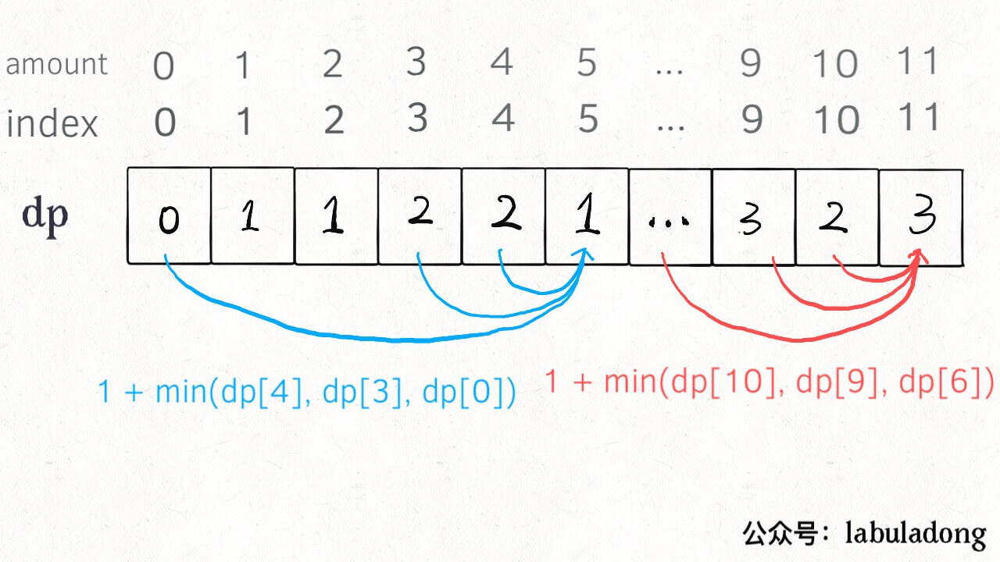
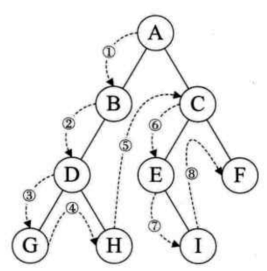
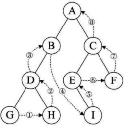
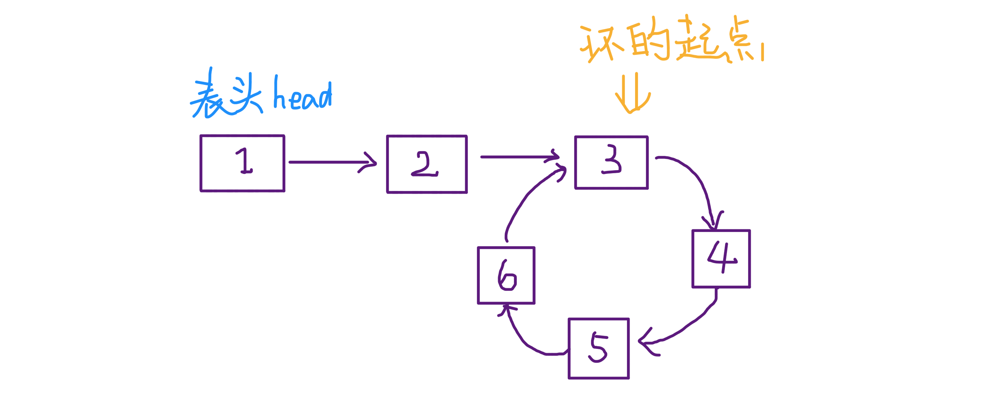

<!-- TOC -->

- [Chapter1：Exercise](#chapter1exercise)
  - [牛顿迭代法](#牛顿迭代法)
  - [欧几里得算法（辗转相除法）](#欧几里得算法辗转相除法)
  - [尼科彻斯定理](#尼科彻斯定理)
  - [位运算](#位运算)
    - [计算整数二进制中1的个数（以int类型为例，32个bit）](#计算整数二进制中1的个数以int类型为例32个bit)
      - [方法1：移动](#方法1移动)
      - [方法2：不通过移动](#方法2不通过移动)
    - [计算一个byte数字对应的二进制数字中1的最大连续数](#计算一个byte数字对应的二进制数字中1的最大连续数)
    - [求两个整数之和](#求两个整数之和)
  - [动态规划](#动态规划)
    - [能用动态规划解决的问题](#能用动态规划解决的问题)
    - [应用动态规划——将动态规划拆分成三个子目标](#应用动态规划将动态规划拆分成三个子目标)
    - [自顶向下](#自顶向下)
    - [自底向上](#自底向上)
    - [题目](#题目)
    - [打家劫舍问题](#打家劫舍问题)
  - [二叉树](#二叉树)
    - [二叉树的构造](#二叉树的构造)
      - [题目](#题目-1)
    - [二叉树的遍历](#二叉树的遍历)
    - [二叉搜索树](#二叉搜索树)
      - [二叉搜索树的查找](#二叉搜索树的查找)
      - [二叉树节点的插入](#二叉树节点的插入)
      - [二叉树节点的删除](#二叉树节点的删除)
    - [平衡二叉树](#平衡二叉树)
  - [图遍历](#图遍历)
    - [深度优先遍历（DFS）回溯](#深度优先遍历dfs回溯)
    - [广度优先遍历（BFS）](#广度优先遍历bfs)
  - [二分查找](#二分查找)
    - [二分查找的改进](#二分查找的改进)
  - [滑动窗口技巧](#滑动窗口技巧)
  - [股票买卖](#股票买卖)
  - [双指针](#双指针)
    - [快慢指针](#快慢指针)
    - [左右指针](#左右指针)

<!-- /TOC -->

# Chapter1：Exercise
增删查改

分析递归问题，最好都画出递归树

两个数的最大公约数和最小公倍数存在以下关系：`最小公倍数×最大公约数 = 两数之积`

## 牛顿迭代法

以直代曲，求方程的近似解。使用函数f(x)的**泰勒级数**的前面几项来寻找方程
$$
f(x) = 0
$$
的根。

迭代公式：
$$
x_{n+1} = x_{n} - \frac{f(x_n)}{f\prime(x_n)}
$$

```c++
\\计算一个数字的立方根，不使用库函数
#include<iostream>
#include<cmath>
using namespace std;
double ND(double& a){
    double x = 1;
    while(abs(x*x*x - a) > 1e-7){
        x = (2*x*x*x + a)/(3*x*x);
    }
    return x;
}
int main(){
    double num;
    while(cin >> num){
        double result = ND(num);
        printf("%.1lf\n", result);
    }
    return 0;
}
```

## 欧几里得算法（辗转相除法）

定理：两个整数的最大公约数等于其中较小的那个数和两数相除余数的最大公约数。最大公约数（Greatest Common Divisor）缩写为GCD。

假如需要求 1997 和 615 两个正整数的最大公约数，用欧几里德算法，是这样进行的：

1997 / 615 = 3 (余 152)

615 / 152 = 4(余7)

152 / 7 = 21(余5)

7 / 5 = 1 (余2)

5 / 2 = 2 (余1)

2 / **1** = 2 (余0)

至此，最大公约数为1。以除数和余数反复做除法运算，当余数为 0 时，取当前算式除数为最大公约数，所以就得出了 1997 和 615 的最大公约数 1。

```c++
//求num1和num2的最小公倍数
#include<iostream>
using namespace std;
int gcd(int a, int b){
    if(a < b) swap(a,b);
    return b==0 ? a:gcd(b,a%b);
}
int main(){
    int num1, num2;
    int result;
    cin >> num1;
    cin >> num2;
    result = (num1*num2)/gcd(num1,num2);
    cout << result << endl;
    return 0;
}
```

## 尼科彻斯定理

任何一个整数m的立方都可以写成m个连续奇数之和。
$$
1^3 = 1\\2^3 = 3+5\\3^3 = 7+9+11\\4^3 = 13+15+17+19
$$

## 位运算

小写比大写的ASCII码大32；

大写变小写、小写变大写：字符^=32

大写变小写、小写变小写：字符|=32

小写变大写、大写变大写：字符&=-33

### 计算整数二进制中1的个数（以int类型为例，32个bit）
#### 方法1：移动

1. 通过移动数字计算

   ```c++
   /*把要求的数字不停的往右移，然后再和1进行与运算*/
   void bitcount(int n){
       int count = 0;
       for(int i = 0; i < 32; i++){
           if((n>>i) & 1){
               count++;
           }
       }
   
       cout << count << endl;
   }
   ```
   
2. 通过移动1来计算

   ```C++
   /*保持要求的数字不变，把1不停的往左移，然后再和移动后的1进行与运算*/
   void bitcount(int n){
       int count = 0;
       for(int i = 0; i < 32; i++){
           if((1<<i) & n){
               count++;
           }
       }
   
       cout << count << endl;
   }
   ```

#### 方法2：不通过移动

1. 消1

   ```c++
   void bitcount(int n){
       /*n&(n-1)可以把n最右边的1给消除掉*/
       int count = 0;
       while( n!= 0 ){
           n &= n-1;
           count++;
       }
   
       cout << count << endl;
   }
   ```

   ```c++
   /*递归方法*/
   int bitcount(int n){
       return n == 0 ? 0 : 1+bitcount(n&(n-1));
   }
   ```

2. 查表

   ```c++
   /*先把0-15转化为2进制，记录下每个数字包含1的个数，再构成一张表，然后再把数字n每4位进行一次计算*/
   void bitcount(int n){
       //table是0-15转化为二进制时1的个数
       int table[] = {0,1,1,2,1,2,2,3,1,2,2,3,2,3,3,4};
       int count = 0;
       while(n != 0){
           count += table[n & 0xf];
           n >>= 4;
       }
   
       cout << count << endl;
   }
   ```

### 计算一个byte数字对应的二进制数字中1的最大连续数

```c++
int num;
int k;
while(cin >> num){
   for(k = 0; num != 0; k++){
       num = num &(num<<1);
   }
   std::cout<<k<<std::endl;
}
```

### 求两个整数之和

```c++
while(num2 != 0){
    int a = ((unsigned int)(num1 & num2)) << 1;
    num1 ^= num2;
    num2 = a;
}
return num1;
/*
*while(b != 0) {
*	c = ((unsigned int)(a & b)) << 1;     1.计算进位c
*	a = a^b;         2.计算无进位和n，赋值给a
*	b = c;           3.将进位c赋值给b
*}
*/
```

## 动态规划

### [能用动态规划解决的问题](https://www.zhihu.com/question/39948290)

要解决的问题能否由其分解的小问题**重复调用**解决

1. 问题的答案依赖于问题的规模，也就是问题的所有答案构成了一个数列
2. 大规模问题的答案可以由小规模问题的答案递推得到，也就是![[公式]](https://www.zhihu.com/equation?tex=f%28n%29)值可以由![[公式]](https://www.zhihu.com/equation?tex=%5C%7Bf%28i%29%7Ci%3Cn%5C%7D)中的个别求得。

### 应用动态规划——将动态规划拆分成三个子目标

1. 建立状态转移方程
2. 缓存并复用以往结果
3. 按顺序从小往大算

首先，动态规划问题的一般形式就是求最值，既然求最值，核心问题是穷举，但是动态规划问题的穷举存在**重叠子问题**，所以需要**DP table**来优化穷举过程；此外，还需要正确的**状态转移方程**才能正确的穷举。

**明确base case->明确状态->明确选择->定义dp数组/函数的含义**

```c++
# 初始化 base case
dp[0][0][...] = base
# 进行状态转移
for 状态1 in 状态1的所有取值：
    for 状态2 in 状态2的所有取值：
        for ...
            dp[状态1][状态2][...] = 求最值(选择1，选择2...)
```

### 自顶向下

将一个大规模问题向下分解为小规模问题，然后逐层返回答案。一般使用递归的方法，比如斐波那契数列的递归求解：

```c++
int fib(vector<int>& dp, int N){
    if(N == 1 || N == 2) return 1;//base case
    if(dp[N] != 0) return dp[N];
    dp[N] = fib(dp, N-1) + fib(dp, N-2);
    return dp[N];
}

int main(){
    int N;
    
    while(cin >> N){
        vector<int> dp(N+1,0);
        cout << fib(dp, N) << endl;
    }
    return 0;
}
```

### 自底向上

直接从最底下、最简单的问题，向上推导出复杂的待求问题。一般自底向上的都是使用迭代的方法，比如斐波那契数列的迭代求解：

```c++
int dp(int N){
    vector<int> dp(N+1, 0);
    dp[1] = dp[2] = 1;//base case
    for(int i = 0; i < N; i++){
        dp[i] = dp[i-1] + dp[i-2];
    }
    return dp[N];
}
```

### 题目

1. 青蛙跳台阶

   ```c++
   /*一只青蛙一次可以跳上1级台阶，也可以跳上2级。求该青蛙跳上一个n级的台阶总共有多少种跳法（先后次序不同算不同的结果）*/
   class Solution {
   public:
       int jumpFloor(int number) {
           if(number == 0 || number == 1) return 1;
           int a = 1, b = 1, c;
           for(int i = 2; i <= number; ++i){
               c = a + b;
               a = b;
               b = c;
           }
           
           return c;
       }
   };
   ```
   
   $$
   f(n) = f(n-1)+f(n-2)
   $$
   
   
   
2. 变态跳台阶

   ```c++
   /*一只青蛙一次可以跳上1级台阶，也可以跳上2级……它也可以跳上n级。求该青蛙跳上一个n级的台阶总共有多少种跳法。*/
   int jumpFloorII(int n) {
       if (n==0 || n==1) return 1;
       int a = 1, b;
       for (int i=2; i<=n; ++i) {
           b = a << 1; //  口诀：左移乘2，右移除2
           a = b;
       }
       return b;
   }
   ```

   $$
   f(n) = f(n-1)*f(n-2)*...*f(1)
   化简得到：
   f(n) = 2^{n-1}*f(1)
   $$

   

3. 一个机器人位于一个 m x n 网格的左上角 （起始点在下图中标记为“Start” ）。机器人每次只能**向下**或者**向右**移动一步。机器人试图达到网格的右下角（在下图中标记为“Finish”）。问总共有多少条不同的路径？


$$
f(i,j) = f(i-1,j)+f(i,j-1)
$$

4. 剪绳子

   ```c++
   /*给你一根长度为 n 的绳子，请把绳子剪成整数长度的 m 段（m、n都是整数，n>1并且m>1），每段绳子的长度记为 k[0],k[1]...k[m-1] 。请问 k[0]*k[1]*...*k[m-1] 可能的最大乘积是多少？*/
   class Solution{
       public:
       int cutRope(int number){
           if(number == 2){
               return 1;
           }
           if(number == 3){
               return 2;
           }
           vector<int> num(number+1, -1);
           if(int i = 1; i <=4; i++){
               num[i] = i;
           }
           for(int j = 5; j <= number; ++j){
               for(int m = 1;m < j; ++m){
                   num[j] = max(num[j], m*num[j-m]);
               }
           }
           return num[number];
       }
   }
   ```

5. #### [375. 猜数字大小 II](https://leetcode-cn.com/problems/guess-number-higher-or-lower-ii/)

6. #### [509. 斐波那契数](https://leetcode-cn.com/problems/fibonacci-number/)

7. #### [322. 零钱兑换](https://leetcode-cn.com/problems/coin-change/)

   

   自底向上解决方法：

   ```c++
   int coinChange(vector<int>& coins, int amount){
       vector<int> dp(amount+1, amount+1);
       dp[0] = 0;//base case
       for(int i = 0; i < dp.size(); i++){
           for(int j = 0; j < coins.size(); j++){
               if(i - coins[j] < 0) continue;
               dp[i] = min(dp[i], 1+dp[i-coins[j]]);
           }
       }
       /*
       for(int i = 0; i < dp.size(); i++){
           for(int coin : coins){
                if(i - coin < 0) continue;
                dp[i] = min(dp[i], 1+dp[i-coin]);
           }
       }
       */
       return (dp[amount] == amount+1) ? -1 : dp[amount];
   }
   ```

   coins为1、2、5的情况下：

   

### 打家劫舍问题

[198. 打家劫舍](https://leetcode-cn.com/problems/house-robber/)

```c++
/*给定一个代表每个房屋存放金额的非负整数数组，计算你 不触动警报装置的情况下 ，一夜之内能够偷窃到的最高金额。*/
//如果两间相邻的房屋在同一晚上被小偷闯入，系统会自动报警
/*递归，自顶向下*/
class Solution{
private:
    int dp(vector<int>& nums,int start, vector<int>& mem){
        if(start == nums.size()){
            return 0;
        }
        if(mem[start] != -1) return mem[start];
        int temp = max(dp(nums, start+1,mem),nums[start]+dp(nums,start+2,mem));
        mem[start] = temp;
        return temp;
    }
public:
    int rob(vector<int>& nums){
        int n = nums.size();
        vector<int> mem(n, -1);
        return dp(nums, 0, mem); 
    }
};
/*自底向上*/
class Solution{
public:
    int rob(vector<int>& nums){
        int n = nums.size();
        int dp[n+2];
        for(int i = 0; i < n+2; i++){
            dp[i] = 0;
        }
        for(int i = n - 1;i >=0; i--){
            dp[i] = max(dp[i+1],nums[i]+dp[i+2]);
        }
        
        return dp[0];
    }  
};
/*自底向上的优化，由于当前只和其后的两个状态有关，所以可以使用变量保存后两个状态的值*/
class Solution{
public:
    int rob(vector<int>& nums){
        int n = nums.size();
        int dp_i_1 = 0, dp_i_2 = 0;
        //记录 dp[i+1] 和 dp[i+2]
        int dp_i = 0;
        // 记录 dp[i]
        for(int i = n - 1;i >=0; i--){
            dp_i = max(dp_i_1,nums[i]+dp_i_2);
            dp_i_2 = dp_i_1;
            dp_i_1 = dp_i;
        }
        
        return dp_i;
    }  
};
```

[213. 打家劫舍 II](https://leetcode-cn.com/problems/house-robber-ii/)

```c++
/*在上题的基础上，所有的房屋都围成一圈，这意味着第一个房屋和最后一个房屋是紧挨着的*/
class Solution {
private:
    int robrange(vector<int>& nums, int start, int end){
        int dp_i_1 = 0, dp_i_2 = 0, dp_i = 0;
        for(int i = end; i>=start; i--){
            dp_i = max(dp_i_1, nums[i]+dp_i_2);
            dp_i_2 = dp_i_1;
            dp_i_1 = dp_i;
        }
        
        return dp_i;
    }
public:
    int rob(vector<int>& nums) {
        int n = nums.size();
        if(n == 1) return nums[0];
        return max(robrange(nums, 0, n-2), robrange(nums, 1, n-1));
    }
};
```

[337. 打家劫舍 III](https://leetcode-cn.com/problems/house-robber-iii/)

```c++
/*这个地方的所有房屋的排列类似于一棵二叉树,相连的两个房子不能同时被抢劫*/
class Solution {
private:
    unordered_map<TreeNode*, int>mem;
public:
    int rob(TreeNode* root) {
        if(root == nullptr){
            return 0;
        }
        if(mem.find(root) != mem.end()){
            return mem[root];
        }
        int do_it = root->val + (root->left == nullptr ? 0 : rob(root->left->left)+rob(root->left->right))+(root->right == nullptr ? 0 : rob(root->right->left)+rob(root->right->right));
        int not_do = rob(root->left) + rob(root->right);

        int temp = max(do_it, not_do);
        mem[root] = temp;

        return temp;
    }
};
```

## 二叉树

**树的度**：是树内所有节点度的最大值，节点的度：节点拥有的子树的个数

### 二叉树的构造

建树的相关步骤：

```c++
// 树结点
struct TreeNode {
    int val;
    TreeNode *left;
    TreeNode *right;
    TreeNode(int x) : val(x), left(nullptr), right(nullptr) { }
};
// 建树的伪代码
TreeNode* build(1...) {
    if (2...) return nullptr;
    TreeNode *root = new TreeNode(3...);
    root->left = build(4...); // 递归建立左子树
    root->right = build(5...); // 递归建立右子树
    return root;
}
// 假设元素在数组v中，并且头结点的下标为 root_index, first < root_index < last,
TreeNode* build(int first, int last) {
    if (first > last) return nullptr;
    TreeNode *root = new TreeNode(v[root_index]);
    root->left = build(first, root_index - 1);
    root->right = build(root_index + 1, last);
    return root;
} 
```

如果大家知道了上述建树的伪代码后，那么括号应该填什么呢？
假设 1.是一个数组vector<int>，是需要建树的元素
那么 2.数组为空，然后 return nullptr.

3. 根结点的值
4. 左子树的数组元素
5. 右子树的数组元素

#### 题目

由前序遍历和中序遍历的结果，重建该二叉数

```c++
class Solution {
public:
    TreeNode* build(vector<int> pre, int pre_left, int pre_right, vector<int> vin, int vin_left, int vin_right){
        if(pre_left > pre_right) return nullptr;
        TreeNode* root = new TreeNode(pre[pre_left]);
        
        for(int i = vin_left; i <= vin_right; ++i){
            if(vin[i] == root->val){
                root->left = build(pre,pre_left+1,pre_left+i-vin_left,vin, vin_left, i-1);
                root->right = build(pre,pre_left+i-vin_left+1,pre_right,vin,i+1,vin_right);
            }
        }
        
        return root;
    }
    
    
    TreeNode* reConstructBinaryTree(vector<int> pre,vector<int> vin) {
        return build(pre, 0, pre.size()-1, vin, 0, vin.size()-1);
    }
};
//root_index - vin_left为根结点左边有几个元素
//pre_left + root_index - vin_left 为从pre_left开始往后推这么多元素pre_left + root_index - vin_left 为从pre_left开始往后推这么多元素
```

### 二叉树的遍历

1. 前序遍历（根左右）

   

   ```c
   void PreOrderTraverse(BiTree* T){
       if(T == NULL){
           return;
       }
       printf("%d/n", T->value);//显示结点数据
       PreOrderTraverse(T->lchind);//先遍历左子树
       PreOrderTraverse(T->rchild);//后遍历右子树
   }
   ```

2. 中序遍历（左根右）

   

   ```c
   void InOrderTraverse(Bitree* T){
       if(T == NULL){
           return;
       }
       InOrderTraverse(T->lchind);//先遍历左子树
       printf("%d\n", T->data);//显示结点数据
       InOrderTraverse(T->rchind);//后遍历右子树
   }
   ```

   

3. 后序遍历（左右根）

   

   ```c
   void PostOrderTraverse(BiTree* T){
       if(T == NULL){
           return;
       }
       PostOrderTraverse(T->lchild);//先遍历左子树
       PostOrderTraverse(T->rchild);//后遍历右子树
       printf("%d\n", T->data);//显示结点数据
   }
   ```

4. 层序遍历

   ```c++
   void LevelTraverseNonRec(BiTree* T){
       if(T == NULL){
           return;
       }
       BiTree* cur;
       queue<int> a;
       a.push(T);
       
       while(!a.empty()){
           cur = a.front();
           cout << cur->data << endl;
           a.pop();
           
           if(cur->lchild){
               a.push(cur->lchild);
           }
           if(cur->rchild){
               a.push(cur->rchild);
           }
       }
   }
   ```

通过遍历可以求得树的深度

```c++
class Solution{
  public:
    int TreeDepth(TreeNode* pRoot){
        if(!pRoot) return 0;
        int dl = TreeDepth(pRoot->left);
        int dr = TreeDepth(pRoot->right);
        return max(dl,dr)+1;
    }
};
```


### 二叉搜索树

BST：binary search tree

对其进行**中序遍历**，得到有序的序列。

#### 二叉搜索树的查找

```c
/*查找key是否存在二叉搜索树T中，指针f指向T的双亲，初始值为NULL，指针p指向查找到的数据节点，并返回True*/
bool SearchBST(BiTree T, int key, BiTree f, BiTree* p){
    if(!T){
        *p = f;
        return false;
    }
    else if(key == T->data){
        *p = T;
        return true;
    }
    else if(key < T->data){
        return SearchBST(T->left, key, T, p);
        //在左子树进行查找
    }
    else{
        return SearchBST(T->right, key, T, p);
        //在右子树进行查找
    }
}
```

#### 二叉树节点的插入

```c
bool InsertBST(BiTree *T, int key){
    BiTree p,s;
    if(!SearchBST(*T, key, NULL, p)){//查找不成功，树中不存在输入的关键字
        s = (BiTree)Malloc(sizeof(BiTree));
        s -> data = key;
        s -> left = s -> right = NULL;
        if(!p){
            *T = s;         //插入s为新的根节点
        }else if(key < p->data){
            p->left = s;    //插入s为左孩子
        }else{
            p->right = s;   //插入s为右孩子
        }
        return true;
    }else{
        return false;
        /*数中已有关键字相同的节点，不再插入*/
    }
}
```

#### 二叉树节点的删除

```c
bool DeleteBST(BiTree* T, int key){
    if(!T){
        return false;
    }
    else{
        if(key == (*T)->data) return Delete(T);
        else if(key < (*T)->data){
            return DeleteBST(&(*T)->left, key);
        }
        else{
            return DeleteBST(&(*T)->right, key);
        }
    }
}

bool Delete(BiTree* p){
    BiTree q,s;
    if((*p)->right == NULL){       //右子树为空，只需接它的左子树
        q = *p;
        *p = (*p)->left;
        free(q);
    }else if((*p)->left == NULL){  //左子数为空，只需接它的右子树
        q = *p;
        *p = (*p)->right;
    }
    else{                          //左右子树均不为空
        q = *p;
        s = (*p)->left;
        while(s->right){           //转左，然后向右到尽头
            q = s;
            s = s->right;
        }
        (*p)->data = s->data;
        if(q != (*p)){
            q->right = s->left;    //重接q的右子树
        }
        else{
            q->left = s->left;     //重接q的左子树
        }
        free(s);
    }
    
    return true;
}
```

### 平衡二叉树

平衡二叉树是一种**二叉排序树**（二叉搜索树），其中每一个节点的左子树和右子树的高度差至多等于1。

红黑树是一种特化的AVL树（平衡二叉树），都是在进行插入和删除操作时通过特定操作保持二叉查找树的平衡，从而获得较高的查找性能。红黑树是一种平衡二叉查找树的变体，它的左右子树高差有可能大于 1，所以红黑树不是严格意义上的AVL，但对之进行平衡的代价较低， 其平均统计性能要强于 AVL

1. 红黑树的根结点为黑
2. 红节点不连续，黑节点可以连续
3. 从一节点到达NULL的所有路径都包含有相同数目的黑色节点

## 图遍历

### 深度优先遍历（DFS）回溯

```c++
result = []
def backtrack(路径, 选择列表):
    if 满足结束条件:
        result.add(路径)
        return

    for 选择 in 选择列表:
        做选择
        backtrack(路径, 选择列表)
        撤销选择
```

46.全排列（Leetcode）

```c++
class Solution{
    private:
    void dfs(vector<int>& nums, int len, int depth, vector<int>& path, vector<int>& used, vector<vector<int>>& res){
        if(depth == len){
            res.emplace_back(path);
            return;
        }
        for(int i = 0; i < len; i++){
            if(used[i]){
                continue;
            }
            path.push_back(nums[i]);
            used[i] = 1;
            dfs(nums, len, depth+1, path, used, res);
            path.pop_back();
            used[i] = 0;
        }
    }
    public:
    vector<vector<int>> permute(vector<int>& nums){
        vector<vector<int>> res;
        int len = nums.size();
        vector<int> path;
        vector<int> used(len, 0);
        dfs(nums, len, 0, path, used, res);
        return res;
    }
};
```

[剑指 Offer 38. 字符串的排列](https://leetcode-cn.com/problems/zi-fu-chuan-de-pai-lie-lcof/)

```c++
/*输入一个字符串，打印出该字符串中字符的所有排列。*/
//考虑输入字符串出现重复的情况
class Solution{
private:
    void dfs(string& s, int len, int index, vector<string>& res)
    {
        if(index == len - 1)
        {
            res.emplace_back(s);
            return;
        }
        set<char> used;
        for(int i = index; i < len; i++)
        {
            if(used.count(s[i])) continue;
            used.insert(s[i]);
            swap(s[i], s[index]);
            dfs(s, len, index+1, res);
            swap(s[i], s[index]);
        }
    }
public:
    vector<string> permutation(string s){
        vector<string> res;
        int len = s.size();
        dfs(s, len, 0, res);
        
        return res;
    }
}
/**************************/
class Solution {
private:
    void dfs (vector<string>& result, vector<char>& c_char, int size, int depth){
        if(depth == size){
            string s_temp(c_char.begin(), c_char.end());
            result.push_back(s_temp);
            return;
        }
        unordered_set<char> path;
        for(int i = depth; i < size; i++){
            if(path.count(c_char[i])){
                continue;
            }
            path.insert(c_char[i]);
            swap(c_char[i],c_char[depth]);
            dfs(result, c_char, size, depth+1);
            swap(c_char[i],c_char[depth]);
        }
    }
public:
    vector<string> permutation(string s) {
        vector<string> result;
        vector<char> c_char;
        int size = s.length();
        for(int i = 0; i < size; i++){
            c_char.push_back(s[i]);
        }
        dfs(result, c_char, size, 0);

        return result;
    }
};
```

```c++
/*解法2,使用next_permutation，其输入必须是升序的*/
class Solution {
public:
    vector<string> Permutation(string str) {
        if(str.empty()) return{};
        vector<string> num;
        sort(str.begin(), str.end());
        num.push_back(str);
        while(next_permutation(str.begin(), str.end())){
            num.push_back(str);
        }
        
        return num;
    }
};
```


N皇后问题

### 广度优先遍历（BFS）

写 BFS 算法都是用**队列**这种数据结构

```c++
// 计算从起点 start 到终点 target 的最近距离
int BFS(Node start, Node target) {
    Queue<Node> q; // 核心数据结构
    Set<Node> visited; // 避免走回头路

    q.offer(start); // 将起点加入队列
    visited.add(start);
    int step = 0; // 记录扩散的步数

    while (q not empty) {
        int sz = q.size();
        /* 将当前队列中的所有节点向四周扩散 */
        for (int i = 0; i < sz; i++) {
            Node cur = q.poll();
            /* 划重点：这里判断是否到达终点 */
            if (cur is target)
                return step;
            /* 将 cur 的相邻节点加入队列 */
            for (Node x : cur.adj())
                if (x not in visited) {
                    q.offer(x);
                    visited.add(x);
                }
        }
        /* 划重点：更新步数在这里 */
        step++;
    }
}
```

111.二叉数的最小深度

```c++
class Solution{
public:
    int minDepth(TreeNode* root){
        if(root == NULL){
            return 0;
        }
        queue<TreeNode*> q;
        q.push(root);
        int depth = 1;
        TreeNode* cur;
        while(!q.empty()){
            int n = q.size();
            for(int i = 0; i < n; i++){
                cur = q.front();
                q.pop();
                if(cur->left == NULL && cur->right == NULL){
                    return depth;
                }
                if(cur->left){
                    p.push(cur->left);
                }
                if(cur->right){
                    p.push(cur->right);
                }
            }
            depth++:
        }
        return depth;
    }
};
```

## 二分查找

搜索前提是搜索的数据是**有序**的，对于需要频繁执行插入或者删除操作的数据集来说，维护有序的数据集如果带来不小的工作量，不建议使用二分查找

```c++
int binarySeaech(vector<int>& nums, int target){
    int left = 0, right = ...;
    while(...){
        int mid = left + (right - left)/2;
        //同样可以使用
        //int mid = (left + right)/2;
        //这种方式可能会溢出
        if(nums[mid] == target){
            ...
        }else if(nums[mid] < target){
            left = ...
        }
        else if(nums[mid] > target){
            right = ...
        }
    }
    
    return ...;
}
```

将「搜索区间」全都统一成了两端都闭

```c++
int binary_search(int[] nums, int target) {
    int left = 0, right = nums.length - 1; 
    while(left <= right) {
        int mid = left + (right - left) / 2;
        if (nums[mid] < target) {
            left = mid + 1;
        } else if (nums[mid] > target) {
            right = mid - 1; 
        } else if(nums[mid] == target) {
            // 直接返回
            return mid;
        }
    }
    // 直接返回
    return -1;
}

int left_bound(int[] nums, int target) {
    int left = 0, right = nums.length - 1;
    while (left <= right) {
        int mid = left + (right - left) / 2;
        if (nums[mid] < target) {
            left = mid + 1;
        } else if (nums[mid] > target) {
            right = mid - 1;
        } else if (nums[mid] == target) {
            // 别返回，锁定左侧边界
            right = mid - 1;
        }
    }
    // 最后要检查 left 越界的情况
    if (left >= nums.length || nums[left] != target)
        return -1;
    return left;
}


int right_bound(int[] nums, int target) {
    int left = 0, right = nums.length - 1;
    while (left <= right) {
        int mid = left + (right - left) / 2;
        if (nums[mid] < target) {
            left = mid + 1;
        } else if (nums[mid] > target) {
            right = mid - 1;
        } else if (nums[mid] == target) {
            // 别返回，锁定右侧边界
            left = mid + 1;
        }
    }
    // 最后要检查 right 越界的情况
    if (right < 0 || nums[right] != target)
        return -1;
    return right;
}
```

### 二分查找的改进

**插值查找** 
`int mid = left + (right - left)*((target-nums[left])/(nums[right]-nums[left]));`，相当于按照比例进行分割，但是，会出现`nums[right]==num[left]`的情况，即除数为零。

**斐波那契查找**
需要构架斐波那契数组，按照斐波那契数组给定的当前值等于其前两个值相加的特性，把要查找的数组的个数作为斐波那契的数，把要查找的数组长度划分：


`int mid  = left + F[k-1]-1`

## 滑动窗口技巧

76.最小覆盖子串

```c++
//伪代码
string s, t;
int left =0, right = 0;
string res = s;
while(right<s.size()){
    window.add(s[righrt]);
    right++;
    //如果符合条件，移动窗口的left
    while(window窗口满足要求){
        res = minlen(res,window);
        window.remove(s[left]);
        left++;
    }
}
return res;
```

```c++
//实现代码
class Solution{
  public:
    string minWindow(string s, string t){
        int start = 0, match = 0, len = INT_MAX;
        int left = 0, right = 0;
        unordered_map<char, int>need;
        unordered_map<char, int>window;
        for(char s1:t) need[s1]++;
        while(right < s.size()){
            char s1 = s[right];
            if(need.count(s1){
                window[s1]++;
                if(need[s1] == window[s1]){
                    match++;
                }
            }
            right++;
            while(match == need.size()){
                char s2 = s[left];
                if(right - left < len){
                    start = left;
                    len = right -left;
                }
                if(need.count(s2)){
                    window[s2]--;
                    if(window[s2] < need[s2]){
                        match--;
                    }
                }
                left++;
            }
        }
        return len == INT_MAX ? "" : s.substr(start,len);  
    }
};
```

438.找到字符串中所有字母异位词

3.无重复字符的最长字串

567.字符串的排列

## 股票买卖

```c++
dp[i][k][0 or 1]
0 <= i <= n-1, 1 <= k <= K
//n 为天数，大 K 为最多交易数，此问题共 n × K × 2 种状态，全部穷举就能搞定。
for 0 <= i < n:
    for 1 <= k <= K:
        for s in {0, 1}:
            dp[i][k][s] = max(buy, sell, rest)
```

[121. 买卖股票的最佳时机](https://leetcode-cn.com/problems/best-time-to-buy-and-sell-stock/)

**确定状态转移方程**

```c++
//dp[i][k][0 or 1]
//0 <= i <= n-1, 1 <= k <= K
//n 为天数，大 K 为最多交易数
//此问题共 n × K × 2 种状态，全部穷举就能搞定。
for 0 <= i < n:
    for 1 <= k <= K:
        for s in {0, 1}:
            dp[i][k][s] = max(buy, sell, rest)

dp[i][k][0] = max(dp[i-1][k][0], dp[i-1][k][1] + prices[i])
              max(   选择 rest  ,             选择 sell    )
/*解释：今天我没有持有股票，有两种可能：
要么是我昨天就没有持有，然后今天选择 rest，所以我今天还是没有持有；
要么是我昨天持有股票，但是今天我 sell 了，所以我今天没有持有股票了。*/

dp[i][k][1] = max(dp[i-1][k][1], dp[i-1][k-1][0] - prices[i])
              max(   选择 rest  ,           选择 buy         )
/*解释：今天我持有着股票，有两种可能：
要么我昨天就持有着股票，然后今天选择 rest，所以我今天还持有着股票；
要么我昨天本没有持有，但今天我选择 buy，所以今天我就持有股票了*/
```

**base case**

```c++
dp[-1][k][0] = 0;
//因为 i 是从 0 开始的，所以 i = -1 意味着还没有开始，这时候的利润当然是0
dp[-1][k][1] = -INT_MAX;
//还没开始的时候，是不可能持有股票的，用负无穷表示这种不可能。
dp[-1][0][0] = 0;
//因为 k 是从 1 开始的，所以 k = 0 意味着根本不允许交易，这时候利润当然是 0 
dp[-1][0][1] = -INT_MAX;
//不允许交易的情况下，是不可能持有股票的，用负无穷表示这种不可能
```

**综上**

```c++
//base case
dp[-1][k][0] = dp[-1][0][0] = 0;
dp[-1][k][1] = dp[-1][0][1] = -INT_MAX;
//状态转移方程
dp[i][k][0] = max(dp[i-1][k][0], dp[i-1][k][1]+prices[i]);
dp[i][k][1] = max(dp[i-1][k][1], dp[i-1][k-1][0]-prices[i]);
```

## 双指针

一类为快慢指针，一类为左右指针；前者主要解决链表中的问题，后者主要解决数组（或者字符串）中的问题。

### 快慢指针



1. 判断链表是否有环

   ```c++
   bool hasCycle(ListNode head){
       ListNode fast, slow;
       fast = slow = head;
       while(fast != NULL & fast.next != NULL){
           fast = fast.next.next;
           slow = slow.next;
           if(slow == fast) return true;
       }
       return false;
   }
   ```

2. 已知链表有环，返回这个环的起始位置

   

   ```c++
   ListNode detectCycle(ListNode head){
       ListNode fast, slow;
       fast = slow = head;
       while(fast != NULL & fast.next != NULL){
           fast = fast.next.next;
           slow = slow.next;
           if(fast == slow) break;
       }
       slow = head;
       while(slow != fast){
           fast = fast.next;
           slow = slow.next;
       }
       return slow;
   }
   ```

3. 寻找链表的中点

   ```c++
   while(fast != NULL & fast->next != NULL){
       fast = fast->next->next;
       slow = slow->next;
   }
   return slow;
   ```

   链表长度为奇数时，slow停在中点位置；长度为偶数时，slow停在中间偏右。寻找链表中点的一个作用是对链表进行归并排序。

4. 寻找链表的倒数第k个元素

题目：

1. [剑指 Offer 22. 链表中倒数第k个节点](https://leetcode-cn.com/problems/lian-biao-zhong-dao-shu-di-kge-jie-dian-lcof/)

```c++
/*输入一个链表，输出该链表中倒数第k个节点。为了符合大多数人的习惯，本题从1开始计数，即链表的尾节点是倒数第1个节点。例如，一个链表有6个节点，从头节点开始，它们的值依次是1、2、3、4、5、6。这个链表的倒数第3个节点是值为4的节点。*/
class Solution {
public:
    ListNode* getKthFromEnd(ListNode* head, int k) {
        ListNode* fast;
        ListNode* slow;
        fast = slow = head;
        for(int i = 0; i < k; i++){
            fast = fast->next;
        }
        while(fast != NULL){
            fast = fast->next;
            slow = slow->next;
        }

        return slow;
    }
};
```

### 左右指针

1. 二分查找

2. #### [剑指 Offer 57. 和为s的两个数字](https://leetcode-cn.com/problems/he-wei-sde-liang-ge-shu-zi-lcof/)

   ```c++
   /*输入一个递增排序的数组和一个数字s，在数组中查找两个数，使得它们的和正好是s。如果有多对数字的和等于s，则输出任意一对即可。*/
   ```

3. 反转数组