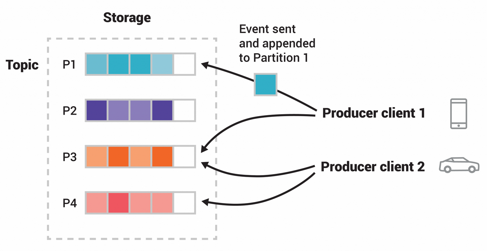

# Kafka简述
kafka是一个事件流平台，具有三个关键特性：
1. 可**发布**(写)和**订阅**(读)事件流，包括从其他系统持续导入或导出数据；
2. 持续可靠的**存储**事件流；
3. 在事件发生或被检索时，**处理**事件流；

这些功能均以分布式、高度可扩展、弹性、容错和安全的方式提供。

kafka可以部署在裸机硬件、虚拟机、容器和云端上，你可以选择自己管理kafka环境或者使用各种供应商提供的管理服务。

# Kafka工作概述
kafka是由**服务端**和**客户端**组成的分布式系统，服务端和客户端之前通过高性能的TCP协议进行通信。

**服务端**：kafka作为一个集群运行在一个或多个服务器上，这个集群可以跨越多个数据中心或云区域。其中，一些服务器组成存储层，被称为“brokers”；一些服务器运行 Kafka Connect ，不但可以将数据作为事件流持续导入和导出，还可以将 Kafka 与现有的系统（如关系数据库以及其他 Kafka 集群）集成。kafka集群的高扩展和容错性，可用于关键任务：如果其中任何一台服务器出现故障，其他服务器将会接管它们的工作，以确保持续的运行而不丢失数据。

**客户端**：允许编写分布式应用程序和微服务，以并行、大规模和容错的方式读、写和处理事件流，即使在网络问题和机器故障的情况下也是如此。

# 主要概念和术语
一个**事件**记录了世界或者商业活动中“某些发生”的事实，它在文档中也被称作记录或者信息；向kafka读取或者写入数据，都是以事件的形式执行，从概念上讲，一个事件包含键、值、时间戳和可选的元数据表头。如下是一个事件样例:
* 事件键: "Alice"
* 事件值: "Made a payment of $200 to Bob"
* 事件时间戳: "Jun. 25,2020 at 2:06 p.m."

**生产者**是那些向Kafka发布(写)事件的客户端应用，**消费者**是那些订阅(读或者处理)事件的客户端。在Kafka中，生产者和消费者是完全解耦并且彼此不可知的，这是实现Kafka众所周知高扩展性的关键特性。例如，生产者永远不需要等待消费者。Kafka提供了例如正好处理事件的能力的各种保证。

事件被组织和持久性存储在**topics**中。一个topic类似文件系统中的文件，事件是该文件夹中的文件。样例中的的topic名称可以是"payments"。Kafka中的topic始终是多个生产者和多个消费者: 一个topic可以有零个、一个或者多个生成者向其写入事件，同样，可以有零个、一个或者多个订阅这些事件的消费者。topic中的事件可以根据需要随时读取(与传统的消息传递系统不同)，事件在消费后不会被删掉。相反，可以通过配置每个topic的设置来决定kafka保留事件的时间，超过配置时间的旧事件将被丢弃。**Kafka的性能在数据大小方面实际上是恒定的，因此，长时间存储数据是非常好的。**

topic是分区的，

* Kafka的API

* 