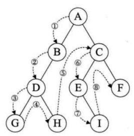

<!-- TOC -->

- [Chapter1：Exercise](#chapter1exercise)
    - [位运算](#位运算)
        - [计算整数二进制中1的个数（以int类型为例，32个bit）](#计算整数二进制中1的个数以int类型为例32个bit)
            - [方法1：移动](#方法1移动)
            - [方法2：不通过移动](#方法2不通过移动)
        - [计算一个byte数字对应的二进制数字中1的最大连续数](#计算一个byte数字对应的二进制数字中1的最大连续数)
        - [求两个整数之和](#求两个整数之和)
    - [动态规划](#动态规划)
    - [树的遍历](#树的遍历)
    - [图遍历](#图遍历)

<!-- /TOC -->

# Chapter1：Exercise
增删查改

分析递归问题，最好都画出递归树


## 位运算

### 计算整数二进制中1的个数（以int类型为例，32个bit）
#### 方法1：移动

1. 通过移动数字计算

   ```c++
   /*把要求的数字不停的往右移，然后再和1进行与运算*/
   void bitcount(int n){
       int count = 0;
       for(int i = 0; i < 32; i++){
           if(((n>>i) & 1) == 1){
               count++;
           }
       }
   
       cout << count << endl;
   }
   ```
   
2. 通过移动1来计算

   ```C++
   /*保持要求的数字不变，把1不停的往左移，然后再和移动后的1进行与运算*/
   void bitcount(int n){
       int count = 0;
       for(int i = 0; i < 32; i++){
           if(((1<<i) & n) != 0){
               count++;
           }
       }
   
       cout << count << endl;
   }
   ```

#### 方法2：不通过移动

1. 消1

   ```c++
   void bitcount(int n){
       /*n&(n-1)可以把n最右边的1给消除掉*/
       int count = 0;
       while( n!= 0 ){
           n &= n-1;
           count++;
       }
   
       cout << count << endl;
   }
   ```

   ```c++
   /*递归方法*/
   int bitcount(int n){
       return n == 0 ? 0 : 1+bitcount(n&(n-1));
   }
   ```

2. 查表

   ```c++
   /*先把0-15转化为2进制，记录下每个数字包含1的个数，再构成一张表，然后再把数字n每4位进行一次计算*/
   void bitcount(int n){
       //table是0-15转化为二进制时1的个数
       int table[] = {0,1,1,2,1,2,2,3,1,2,2,3,2,3,3,4};
       int count = 0;
       while(n != 0){
           count += table[n & 0xf];
           n >>= 4;
       }
   
       cout << count << endl;
   }
   ```

### 计算一个byte数字对应的二进制数字中1的最大连续数

```c++
int num;
int k;
while(cin >> num){
   for(k = 0; num != 0; k++){
       num = num &(num<<1);
   }
   std::cout<<k<<std::endl;
}
```

### 求两个整数之和

```c++
while(num2 != 0){
    int a = ((unsigned int)(num1 & num2)) << 1;
    num1 ^= num2;
    num2 = a;
}
return num1;
```

## 动态规划

### [能用动态规划解决的问题](https://www.zhihu.com/question/39948290)

要解决的问题能否由其分解的小问题**重复调用**解决

1. 问题的答案依赖于问题的规模，也就是问题的所有答案构成了一个数列
2. 大规模问题的答案可以由小规模问题的答案递推得到，也就是![[公式]](https://www.zhihu.com/equation?tex=f%28n%29)值可以由![[公式]](https://www.zhihu.com/equation?tex=%5C%7Bf%28i%29%7Ci%3Cn%5C%7D)中的个别求得。

### 应用动态规划——将动态规划拆分成三个子目标

1. 建立状态转移方程
2. 缓存并复用以往结果
3. 按顺序从小往大算

首先，动态规划问题的一般形式就是求最值，既然求最值，核心问题是穷举，但是动态规划问题的穷举存在**重叠子问题**，所以需要**DP table**来优化穷举过程；此外，还需要正确的**状态转移方程**才能正确的穷举。

**明确base case->明确状态->明确选择->定义dp数组/函数的含义**

```c++
# 初始化 base case
dp[0][0][...] = base
# 进行状态转移
for 状态1 in 状态1的所有取值：
    for 状态2 in 状态2的所有取值：
        for ...
            dp[状态1][状态2][...] = 求最值(选择1，选择2...)
```

### 题目：

1. 青蛙跳台阶

   ```c++
   /*一只青蛙一次可以跳上1级台阶，也可以跳上2级。求该青蛙跳上一个n级的台阶总共有多少种跳法（先后次序不同算不同的结果）*/
   class Solution {
   public:
       int jumpFloor(int number) {
           if(number == 0 || number == 1) return 1;
           int a = 1, b = 1, c;
           for(int i = 2; i <= number; ++i){
               c = a + b;
               a = b;
               b = c;
           }
           
           return c;
       }
   };
   ```
2. 变态跳台阶

   ```c++
   /*一只青蛙一次可以跳上1级台阶，也可以跳上2级……它也可以跳上n级。求该青蛙跳上一个n级的台阶总共有多少种跳法。*/
   int jumpFloorII(int n) {
       if (n==0 || n==1) return 1;
       int a = 1, b;
       for (int i=2; i<=n; ++i) {
           b = a << 1; //  口诀：左移乘2，右移除2
           a = b;
       }
       return b;
   }
   ```

3. 一个机器人位于一个 m x n 网格的左上角 （起始点在下图中标记为“Start” ）。机器人每次只能**向下**或者**向右**移动一步。机器人试图达到网格的右下角（在下图中标记为“Finish”）。问总共有多少条不同的路径？


$$
f(i,j) = f(i-1,j)+f(i,j-1)
$$

4. 剪绳子

   ```c++
   class Solution{
       public:
       int cutRope(int number){
           if(number == 2){
               return 1;
           }
           if(number == 3){
               return 2;
           }
           vector<int> num(number+1, -1);
           if(int i = 1; i <=4; i++){
               num[i] = i;
           }
           for(int j = 5; j <= number; ++j){
               for(int m = 1;m < j; ++m){
                   num[j] = max(num[j], m*num[j-m]);
               }
           }
           return num[number];
       }
   }
   ```

5. 字符串的排列（剑指offer）
6. 猜数字大小（Leetcode）


## 树

### 数的构造

建树的相关步骤：

```c++
// 树结点
struct TreeNode {
    int val;
    TreeNode *left;
    TreeNode *right;
    TreeNode(int x) : val(x), left(nullptr), right(nullptr) { }
};
// 建树的伪代码
TreeNode* build(1...) {
    if (2...) return nullptr;
    TreeNode *root = new TreeNode(3...);
    root->left = build(4...); // 递归建立左子树
    root->right = build(5...); // 递归建立右子树
    return root;
}
```

如果大家知道了上述建树的伪代码后，那么括号应该填什么呢？
假设 1.是一个数组vector<int>，是需要建树的元素
那么 2.数组为空，然后 return nullptr.

3. 根结点的值
4. 左子树的数组元素
5. 右子树的数组元素

**思考**：由前序遍历和中序遍历的结果，重建该二叉数

### 数的遍历

1. 前序遍历（根左右）

   

   ```c
   void PreOrderTraverse(BiTree* T){
       if(T == NULL){
           return;
       }
       printf("%d/n", T->value);//显示结点数据
       PreOrderTraverse(T->lchind);//先遍历左子树
       PreOrderTraverse(T->rchild);//后遍历右子树
   }
   ```

2. 中序遍历（左根右）

   

   ```c
   void InOrderTraverse(Bitree* T){
       if(T == NULL){
           return;
       }
       InOrderTraverse(T->lchind);//先遍历左子树
       printf("%d\n", T->data);//显示结点数据
       InOrderTraverse(T->rchind);//后遍历右子树
   }
   ```

   

3. 后序遍历（左右根）

   

   ```c
   void PostOrderTraverse(BiTree* T){
       if(T == NULL){
           return;
       }
       PostOrderTraverse(T->lchild);//先遍历左子树
       PostOrderTraverse(T->rchild);//后遍历右子树
       printf("%d\n", T->data);//显示结点数据
   }
   ```

4. 层序遍历

   ```c++
   void LevelTraverseNonRec(BiTree* T){
       if(T == NULL){
           return;
       }
       BiTree* cur;
       queue<int> a;
       a.push(T);
       
       while(!a.empty()){
           cur = a.front();
           cout << cur->data << endl;
           a.pop();
           
           if(cur->lchild){
               a.push(cur->lchild);
           }
           if(cur->rchild){
               a.push(cur->rchild);
           }
       }
   }
   ```

## 图遍历

### 深度优先遍历（DFS）回溯

数字的全排列

```c++
class Solution{
    private:
    void dfs(vector<int>& nums, int len, int depth, vector<int>& path, vector<int>& used, vector<vector<int>>& res){
        if(depth == len){
            res.emplace_back(path);
            return;
        }
        for(int i = 0; i < len; i++){
            if(used[i]){
                continue;
            }
            path.push_back(nums[i]);
            used[i] = 1;
            dfs(nums, len, depth+1, path, used, res);
            path.pop_back();
            used[i] = 0;
        }
    }
    public:
    vector<vector<int>> permute(vector<int>& nums){
        vector<vector<int>> res;
        int len = nums.size();
        vector<int> path;
        vector<int> used(len, 0);
        dfs(nums, len, 0, path, used, res);
        return res;
    }
};
```

### 广度优先遍历（BFS）

111.二叉数的最小深度

```c++
class Solution{
public:
    int minDepth(TreeNode* root){
        if(root == NULL){
            return 0;
        }
        queue<TreeNode*> q;
        q.push(root);
        int depth = 1;
        TreeNode* cur;
        while(!q.empty()){
            int n = q.size();
            for(int i = 0; i < n; i++){
                cur = q.front();
                q.pop();
                if(cur->left == NULL && cur->right == NULL){
                    return depth;
                }
                if(cur->left){
                    p.push(cur->left);
                }
                if(cur->right){
                    p.push(cur->right);
                }
            }
            depth++:
        }
        return depth;
    }
};
```

## 二分查找

```c++
int binarySeaech(vector<int>& nums, int target){
    int left = 0, right = ...;
    while(...){
        int mid = left + (right - left)/2;
        //同样可以使用
        //int mid = (left + right)/2;
        //这种方式可能会溢出
        if(nums[mid] == target){
            ...
        }else if(nums[mid] < target){
            left = ...
        }
        else if(nums[mid] > target){
            right = ...
        }
    }
    
    return ...;
}
```

将「搜索区间」全都统一成了两端都闭

```c++
int binary_search(int[] nums, int target) {
    int left = 0, right = nums.length - 1; 
    while(left <= right) {
        int mid = left + (right - left) / 2;
        if (nums[mid] < target) {
            left = mid + 1;
        } else if (nums[mid] > target) {
            right = mid - 1; 
        } else if(nums[mid] == target) {
            // 直接返回
            return mid;
        }
    }
    // 直接返回
    return -1;
}

int left_bound(int[] nums, int target) {
    int left = 0, right = nums.length - 1;
    while (left <= right) {
        int mid = left + (right - left) / 2;
        if (nums[mid] < target) {
            left = mid + 1;
        } else if (nums[mid] > target) {
            right = mid - 1;
        } else if (nums[mid] == target) {
            // 别返回，锁定左侧边界
            right = mid - 1;
        }
    }
    // 最后要检查 left 越界的情况
    if (left >= nums.length || nums[left] != target)
        return -1;
    return left;
}


int right_bound(int[] nums, int target) {
    int left = 0, right = nums.length - 1;
    while (left <= right) {
        int mid = left + (right - left) / 2;
        if (nums[mid] < target) {
            left = mid + 1;
        } else if (nums[mid] > target) {
            right = mid - 1;
        } else if (nums[mid] == target) {
            // 别返回，锁定右侧边界
            left = mid + 1;
        }
    }
    // 最后要检查 right 越界的情况
    if (right < 0 || nums[right] != target)
        return -1;
    return right;
}
```

